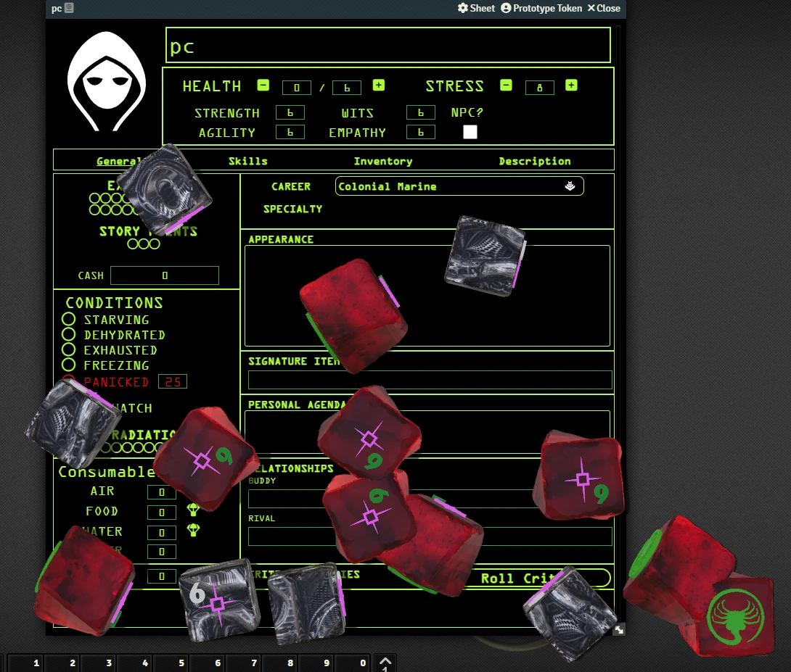

# Alien Dice
This module add a new dice models for **Alien RPG**.

  

## Features
- New dice Alien RPG.
- Includes Animated Dice.

# Instalation
You can install this module with this link: https://raw.githubusercontent.com/brunocalado/alien-dice/main/module.json

# How To
- Activated the module. 
- Go to Compendium and Alien Dice - Docs. There is a README journal in there with instructions.

# Acknowledges
- Erich Matos Viegas (Sal)

# License
[LICENSE](https://github.com/brunocalado/alien-dice/blob/main/LICENSE)

# Changes
You can see changes at [CHANGELOG](CHANGELOG.md).

# License
[LICENSE](https://github.com/brunocalado/alien-dice/blob/main/LICENSE.md)

# Assets License
[LICENSE](https://github.com/brunocalado/alien-dice/blob/main/LICENSE-ASSETS.md)